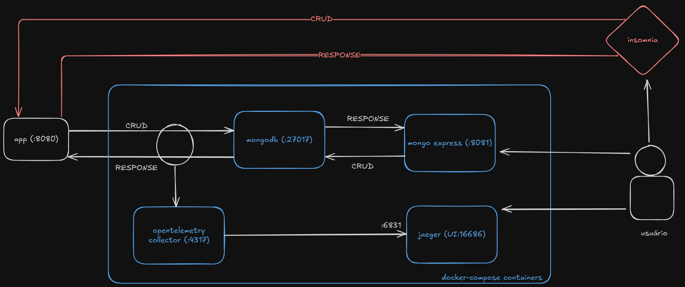

# Documentação do Desafio Técnico de SRE/DevOps

## 🚀 Tecnologias

Este projeto foi desenvolvido com as seguintes tecnologias:

- go
- docker
- mongodb
- opentelemetry
- jaeger

## 📦 Arquitetura da Aplicação



## 📦 Instalação

1. Clone o repositório:

```bash
git clone https://github.com/kauanpecanha/devops-sre-challenge.git
```

2. Instale as dependências:

```bash
go get .
```

3. Se Windows, abra o Docker Desktop. Se Linux, garanta que o serviço do Docker esteja ativo. 

4. Suba os containers do MongoDB, Mongo Express, OpenTelemetry, Prometheus e Jaeger
```bash
docker-compose up -d
```

5. Inicie a aplicação
```bash
go run .
```

6. Utilize o Insomnia/Postman para efetuar as operações de CRUD. Elas podem ser efetuadas conforme o arquivo yaml que se encontra em insomnia\Insomnia_2025-08-12.yaml

7. Acesse as URLs abaixo para mais informações relacionadas ao escopo do projeto:
   - http://localhost:8081/ (página de administração do mongodb de credenciais admin/pass
   - http://localhost:16686/ (página de monitoramento de traces)